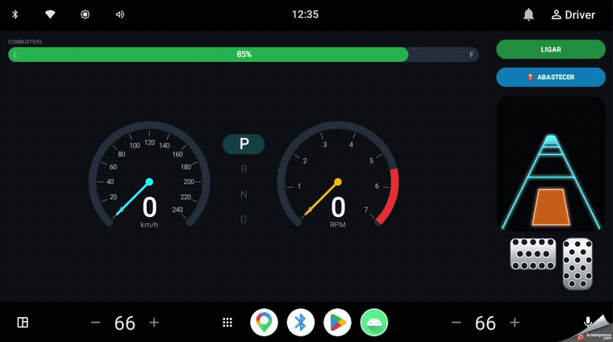

# Vehicle Dashboard

An Android Automotive (AAOS) infotainment cluster that displays live vehicle telemetry -
speed, engine RPM, gear and fuel level - and lets the user interact with the vehicle through
accelerator/brake pedals, ignition and refuel controls. Vehicle data is provided by a mocked
source that simulates the CAN bus / VHAL as a continuous reactive stream.

The project was built to exercise a production-grade Android stack: Clean Architecture, MVVM,
Hilt, Kotlin Coroutines/Flow and custom `Canvas`-based views.

## Demo



## Download

The latest APK is available on the
[Releases page](https://github.com/tercette/VehicleDashboard/releases/latest). Install it on an
Android device (enable installation from unknown sources) or run it on the Android Automotive
emulator. The same APK works on both, since the automotive feature is declared as optional.

## Features

- Analog speedometer and tachometer (with redline), P-R-N-D gear indicator and a fuel level bar,
  all drawn from scratch with `Canvas`.
- Interactive controls: hold-to-press accelerator and brake pedals, ignition (start/stop) and a
  refuel action.
- A driving scene rendered in real time, whose motion is proportional to the current speed.
- Coherent vehicle physics in the mock: the engine only runs with ignition on and fuel available;
  fuel is consumed while running; RPM drops to zero when the engine is off.
- Runs on the Android Automotive emulator and on a regular phone (the automotive feature is
  declared as optional).

## Architecture

Clean Architecture with three layers and dependencies pointing inward. The domain layer knows
nothing about Android and is testable in isolation.

```
presentation  ->  domain  <-  data
   (MVVM)        (models,      (mocked source,
                 contracts,     mapper,
                 use cases)     repository impl)
```

Data flows in two directions:

- Read (state goes up): `FakeVehicleDataSource` emits a raw `Flow`, `VehicleRepositoryImpl` maps
  it to the domain model, the use case forwards it, the `DashboardViewModel` exposes it as a
  `StateFlow<DashboardUiState>`, and the `Activity` collects it with `repeatOnLifecycle`.
- Write (commands go down): pedal/ignition/refuel input travels
  View -> ViewModel -> `ControlVehicleUseCase` -> repository -> source. The UI never talks to the
  data source directly.

## Tech stack

- Kotlin
- Clean Architecture + MVVM
- Hilt (dependency injection, KSP)
- Kotlin Coroutines / Flow / StateFlow
- XML layouts with ViewBinding
- Custom Views (`Canvas`, `ValueAnimator`, `Choreographer`, `BlurMaskFilter`)
- Gradle (Kotlin DSL) with a version catalog
- JUnit for unit tests

## Project structure

```
com.volks.vehicledashboard/
  VehicleDashboardApp.kt        Application (Hilt entry point)
  di/                           Hilt module (interface -> implementation binding)
  domain/
    model/                      VehicleData
    repository/                 VehicleRepository (contract)
    usecase/                    ObserveVehicleDataUseCase, ControlVehicleUseCase
  data/
    source/                     VehicleDataDto, FakeVehicleDataSource
    mapper/                     VehicleMapper (DTO -> domain)
    repository/                 VehicleRepositoryImpl
  presentation/
    dashboard/                  DashboardUiState, DashboardViewModel, DashboardActivity
    widget/                     GaugeView, GearIndicatorView, FuelBarView, PedalView, RoadView
```

## Requirements

- Android Studio (recent stable)
- Android SDK, minSdk 30
- An Android Automotive system image (to run on the AAOS emulator) or any phone emulator/device

## Build and run

Clone the repository and open it in Android Studio, then run the `app` configuration on a device
or emulator.

From the command line:

```
./gradlew assembleDebug        # build the debug APK
./gradlew installDebug         # build and install on a connected device/emulator
```

To run on the Android Automotive emulator, install an Automotive system image via the SDK Manager,
create an AVD with the Automotive profile and select it as the run target. The car starts turned
off - use the ignition control to start it.

## Testing

```
./gradlew testDebugUnitTest
```

`VehicleMapperTest` covers the unit conversions (m/s to km/h, ratio to percent with clamping) and
the gear-code mapping. Because the conversion logic lives in the mapper (pure Kotlin, no Android
dependencies), it runs on the JVM without an emulator.

## Notes

- The vehicle data source is mocked. Replacing it with a real source (VHAL / Car Service) only
  affects the `data` layer - the domain and presentation layers stay untouched, which is the main
  benefit of the architecture.
- Release packaging in the target platform uses a proprietary supplier pipeline; this repository
  uses the standard Gradle build.
